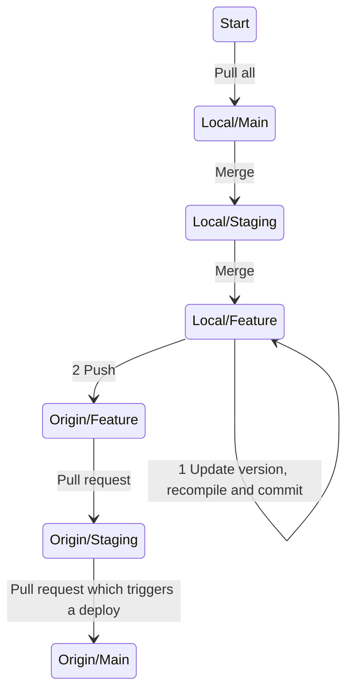

# Launch Process

## Normal
The process listed here will ensure that merge conflicts will be addressed locally. All pull requests should end up clean.

The feature branch is whatever branch with new code you a looking to deploy. Feature branches should start with `feature-` or `hot-fix-`

## Hot fix
Not yet documented